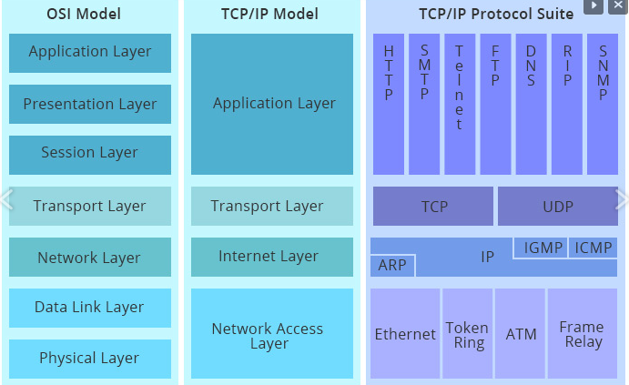

# Introdução: Networking

A ISO reconheceu a necessidade de criar um modelo de rede para ajudar os desenvolvedores a implementar redes que poderiam comunicar-se e trabalhar juntas (interoperabilidade).

Assim, a ISO lançou em 1984 o modelo de referência OSI (Open System Interconection).

> “O modelo de referência OSI é o modelo de referência de rede mais amplamente conhecido. Ele é usado para a elaboração de rede de dados, especificações de operação e resolução de problemas.” (CCNA Exploration – CISCO)

## <mark style="color:red;">Modelo de Referência OSI (Open System Interconection)</mark>

Cada camada possui um papel (responsabilidade) na comunicação entre dois dispositivos.&#x20;

<figure><figcaption></figcaption></figure>

<figure><figcaption></figcaption></figure>

<figure><figcaption></figcaption></figure>

### <mark style="color:red;">Encapsulamento</mark>

Ao transmitir os dados a partir da camada de aplicação de um host de origem para um host de destino, temos o processo de encapsulamento nas camadas inferiores;

<figure><figcaption></figcaption></figure>

Informações referentes a cada uma das camadas são adicionadas aos dados recebidos da camada superior (cabeçalho do protocolo da respectiva camada) para possibilitar o endereçamento de origem e destino (porta, IP e MAC) do PDU (segmento, pacote e frame/quadro), bem como outros controles de cada protocolo.

<figure><figcaption></figcaption></figure>

<figure><figcaption></figcaption></figure>

#### <mark style="color:yellow;">Em quais camadas estão os serviços de rede?</mark>

A interação do usuário com os serviços e recursos disponíveis em uma rede acontece na camada de aplicação:

<figure><figcaption></figcaption></figure>

***
